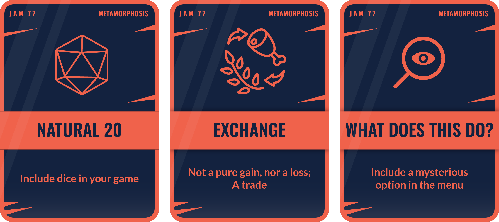

# Metamorphosis - Project by Armand Alvarez

Defined - change of physical form, structure, or substance. 2. : a marked and more or less abrupt developmental change in the form or structure of an animal (as a butterfly or a frog) occurring subsequent to birth or hatching.

---

---

# Ideas

1) You play as a caterpillar in a top-down roguelike (similar to vampire survivor) -- if you collect enough power-up currency items (maybe leaves?) you can temporarily transform into a butterfly and gain immense power to give yourself some breathing room 

---

# Features

- [x] Caterpillar
  - [x] Art & Animations 
  - [x] Movement 
  - [x] Health
  - [x] Manual attack
    - [x] swipe tail in direction with short-range arc-shaped projectile
- [ ] Transformation
  - [x] Power-up meter
  - [x] Power pickups (leaves)
  - [ ] Transformation into a butterfly
- [x] Upgrades
  - [x] Increase attack rate
  - [x] Increase health
  - [x] Increase attack damage 
- [ ] Butterfly
  - [ ] Art & animations
  - [ ] Movement
  - [ ] Super armor
  - [ ] Auto-attack
    - [ ] 8 projectiles in octogon around butterfly
  - [ ] Quick movement 
- [ ] Enemies
  - [x] Ants
  - [ ] Hornets !!!!!!
  - [ ] Birds  !!!!!
  - [ ] Animations
- [ ] Main Menu 
  - [x] Start game
  - [x] Upgrades
  - [x] Quit game
  - [ ] Improve look
- [ ] Background art 
  - [ ] Map

## Features to add if you have time
- [ ] Bosses
  - [ ] Spiders
  - [ ] Eagle

# Debug 
- [x] Fix caterpillar hitbox registration !!!!!!!!
- [x] Fix upgrades menu not buying at 10 leaves !!!!!!!!
- [ ] Potentially decrease size of coin gravity area2D
  - Coins are still following the player character after enemy dies. We only want coins to gravitate towards the player if they are very close to them