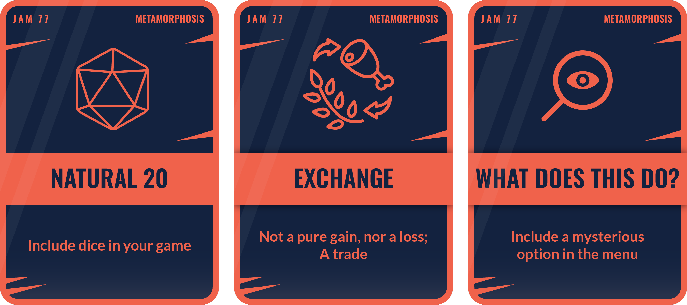

# Metamorphosis - Project by Armand Alvarez

Defined - change of physical form, structure, or substance. 2. : a marked and more or less abrupt developmental change in the form or structure of an animal (as a butterfly or a frog) occurring subsequent to birth or hatching.

---

---

# Ideas

1) You play as a caterpillar in a top-down roguelike (similar to vampire survivor) -- if you collect enough power-up currency items (maybe leaves?) you can temporarily transform into a butterfly and gain immense power to give yourself some breathing room 

---

# Features

- [ ] Transformation
  - [ ] Power-up meter
  - [ ] Transformation into a butterfly
- [ ] Caterpillar
  - [ ] Health
  - [ ] Manual attack
    - [ ] swipe tail in direction with short-range arc-shaped projectile 
- [ ] Upgrades
  - [ ] Increase attack rate
  - [ ] Increase health
  - [ ] Increase attack damage 
- [ ] Butterfly 
  - [ ] Super armor 
  - [ ] Auto-attack
    - [ ] 8 projectiles in octogon around butterfly
  - [ ] Quick movement 
- [ ] Enemies
  - [ ] Ants
  - [ ] Hornets
  - [ ] Birds 
- [ ] Bosses
  - [ ] Spiders
  - [ ] Eagle
- [ ] Main Menu
  - [ ] Start game
  - [ ] Quit game
- [ ] 